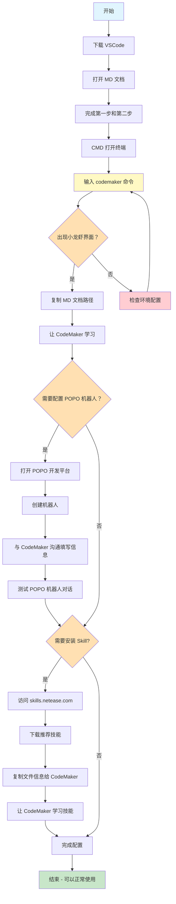

# 新人教学流程 - CodeMaker 配置指南

## 流程图

## 详细步骤说明

### 第一阶段：环境准备
1. **下载 VSCode** - 安装 Visual Studio Code 编辑器
2. **打开 MD 文档** - 打开提供的说明文档
3. **完成前两步** - 按照 MD 文档完成第一步和第二步的配置

### 第二阶段：启动 CodeMaker
4. **打开终端** - 使用 CMD 打开命令行终端
5. **启动命令** - 输入 `codemaker`（无空格）
6. **确认界面** - 出现公司破译版本的小龙虾界面

### 第三阶段：学习配置
7. **文档学习** - 复制 MD 文档路径，让 CodeMaker 自主学习

### 第四阶段：POPO 机器人配置（可选）
8. **访问开发平台** - 打开 https://open-dev.popo.netease.com/robot
9. **创建机器人** - 在平台创建新机器人
10. **填写信息** - 与 CodeMaker 沟通，填写相关配置信息
11. **测试对话** - 验证 POPO 龙虾机器人是否可以正常对话

### 第五阶段：Skill 扩展（可选）
12. **访问技能平台** - 打开 https://skills.netease.com/
13. **下载技能** - 选择推荐技能进行下载
14. **学习技能** - 复制文件信息给 CodeMaker，让它学习新技能

---

**备注：**
- 带菱形的步骤为判断节点，根据实际需求选择分支
- POPO 机器人配置和 Skill 安装为可选步骤
- 如有问题可随时与 CodeMaker 沟通
